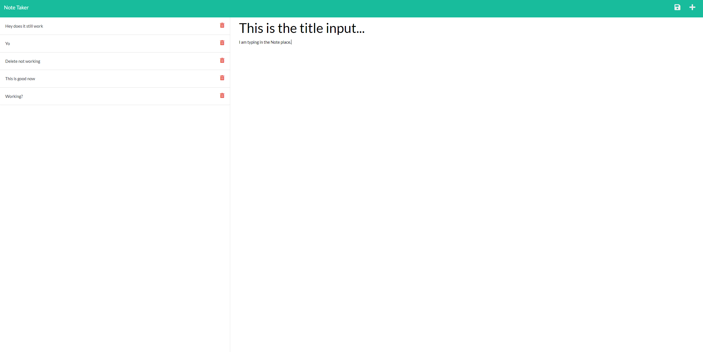

  # Express Js Note Taker

1. [Description](#Description)
2. [Install Instructions](#Install-Instructions)
3. [How to use this app](#How-to-use-this-app)
4. [License](#License)
5. [Credits](#Credits)
6. [Tests](#Tests)
7. [Github](#Github)
8. [Contact Me](#Contact-Me)

  
          
  
  
  ## Description 
  This app uses express to create an app that can be used to take notes in the browser. The process is done by saving and retrieving data from a json file. I was given a lot of starter code but had 
  to create the routes js files and the boiler plate serverjs file. 
  
  ## Install Instructions
  When you download the code you need to run a npm install to have access to the node modules.
  
  ## How to use this app
  If you are at my heroku page it has a simple UI. You type in the title and content of the note and save it by pressing the save button in the top right hand corner.
  Your note is then added to the list. I couldn't get the delete function working but that will be something to come back to and fix later.
  
  
## License
N/A
        
    
  
  ## Credits
  This application was made by Maximillian

  ## Tests
  No testing.

  ## Github 
 Here is the link to my github account [Wolfgang978](https://github.com/Wolfgang978)
  
  
  ## Contact Me
  If you have any further questions about the application you can reach me at 18wrightm@gmail.com

  ## Screenshot
  

 ## Link
 Here is the link the site [Heroku](https://pure-hamlet-36368.herokuapp.com/)
 
